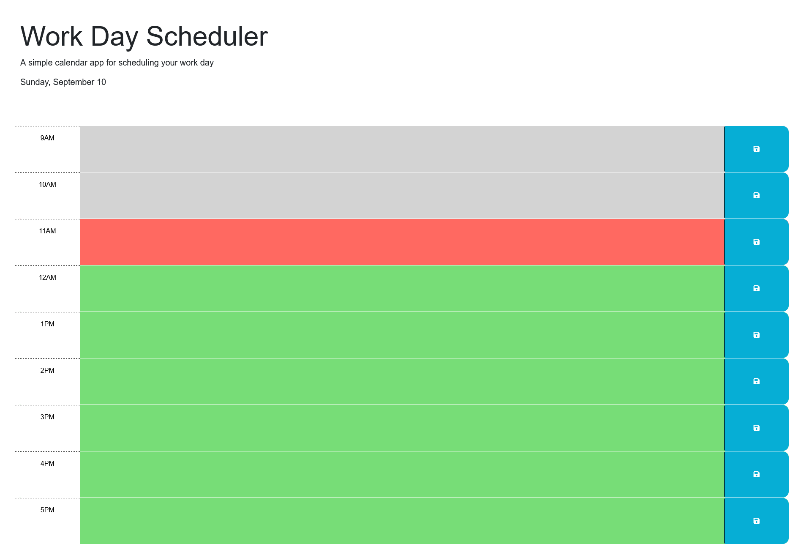

# angelo-scheduler-challenge
Module 5 Challenge for UT Full-Stack Bootcamp: Javascript Library Utilization
[Starter Code](https://github.com/coding-boot-camp/crispy-octo-meme)

## Main Objective
This website serves as a handy tool for scheduling tasks for each hour between 9am and 5pm, as well as informing the user of the current time and its associated task.

## Website
[Github Link](https://whatnameshouldiuse.github.io/angelo-scheduler-challenge/)

## License
License information can be found in repo.